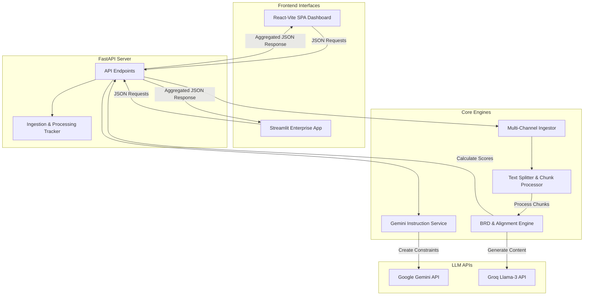

# 🎯 ReqMind AI — Alignment Intelligence System

> An AI-powered requirements engineering platform that transforms multi-channel stakeholder communication (emails, Slack, meeting transcripts) into structured Business Requirements Documents (BRDs). It automatically detects conflicts, assesses timelines, and scores project alignment using Gemini and Groq LLMs.

---

<div align="center">

[](https://www.python.org/)
[](https://fastapi.tiangolo.com/)
[](https://react.dev/)
[](https://vitejs.dev/)
[](https://streamlit.io/)
[](LICENSE)

</div>

---

## 📖 Table of Contents
- [🌟 Key Features](#-key-features)
- [🏗️ System Architecture](#️-system-architecture)
- [📁 Project Structure](#-project-structure)
- [🚀 Quick Start Guide](#-quick-start-guide)
  - [1. Backend Setup](#1-backend-setup)
  - [2. React Frontend Setup](#2-react-frontend-setup)
  - [3. Streamlit Frontend Setup](#3-streamlit-frontend-setup)
- [⚙️ Configuration (.env)](#️-configuration-env)
- [📊 API Reference](#-api-reference)
- [🧠 Deep Dive: Core Intelligent Features](#-deep-dive-core-intelligent-features)
- [🧪 Running Tests](#-running-tests)
- [🤝 Contributing](#-contributing)
- [📝 License](#-license)

---

## 🌟 Key Features

### 🔹 Alignment Intelligence Engine
- **Conflict Detection**: Spots contradictions between stakeholders (e.g., Timeline mismatch between Dev and PM).
- **Alignment Scoring**: Dynamically calculates a project alignment score ($0-100\%$) based on timeline consistency, stakeholder agreement, requirement stability, and decision volatility.
- **Early Warning System**: Flags alignment risks as **HIGH**, **MEDIUM**, or **LOW** with action-oriented recommendations.

### 🔹 Gemini-Powered User Instruction Layer
- Provide natural language instructions to prioritize or filter requirements (e.g., *"Focus on MVP features, ignore marketing discussions, and prioritize mobile features"*).
- Converts raw guidelines into structured JSON constraints via Google's Gemini API before running the core analysis.

### 🔹 Large Data Handling (Automatic Chunking)
- Automatically splits files and meeting transcripts exceeding 3,000 words into overlapping chunks to bypass LLM token limits.
- Processes chunks in parallel and deduplicates/merges extracted requirements cleanly.

### 🔹 Ingestion Transparency & Explainability
- Reports exact metrics (word counts, processing duration, chunk sizes).
- Includes random representative metadata samples (Slack channels, emails, speakers) so users can audit what went into the BRD.

---

## 🏗️ System Architecture



---

## 📁 Project Structure

```
reqmind-ai/
├── app/                           # Backend FastAPI Application
│   ├── main.py                    # API Entrypoint
│   ├── config.py                  # Settings & Environment Variables
│   ├── dependencies.py            # FastAPI dependency injections
│   ├── models/                    # Pydantic schemas (Request/Response)
│   ├── routers/                   # API Endpoints (brd, context, dataset)
│   ├── services/                  # Core engines (alignment, generation, gemini)
│   └── utils/                     # Helpers (text splitter, custom logger)
├── frontend-react/                # React SPA Frontend (Vite)
│   ├── src/                       # Source components, pages, hooks
│   ├── package.json               # Node.js dependencies
│   └── vite.config.js             # Vite configurations
├── frontend/                      # Streamlit Python Frontend
│   ├── app.py                     # Light dashboard UI
│   └── app_enterprise.py          # Enterprise SaaS Dashboard UI
├── tests/                         # Pytest Suite
│   └── ...                        # Property-based, integration & unit tests
├── datasets/                      # Sample datasets
│   ├── ami_transcripts/           # Meeting transcripts
│   └── enron_emails.csv           # Email datasets
├── .env.example                   # Configuration template
├── requirements.txt               # Backend Python dependencies
└── pytest.ini                     # Pytest configuration
```

---

## 🚀 Quick Start Guide

### 1. Backend Setup

1. **Clone the repository:**
   ```bash
   git clone https://github.com/harshidev58-cpu/BRD-Reqmind.git
   cd BRD-Reqmind
   ```

2. **Create and activate a virtual environment:**
   ```bash
   python3 -m venv venv
   source venv/bin/activate  # Windows: venv\Scripts\activate
   ```

3. **Install the dependencies:**
   ```bash
   pip install -r requirements.txt
   ```

4. **Set up the Environment variables:**
   ```bash
   cp .env.example .env
   # Open .env and add your Groq and Gemini API keys (see Configuration section below)
   ```

5. **Start the FastAPI backend:**
   ```bash
   uvicorn app.main:app --reload --port 8000
   ```
   - API Docs will be available at: [http://localhost:8000/docs](http://localhost:8000/docs)

---

### 2. React Frontend Setup

The React frontend provides a responsive single-page dashboard with visual graphs for alignment scores, timeline tracking, and real-time interactive BRD generations.

1. **Navigate to the react folder:**
   ```bash
   cd frontend-react
   ```

2. **Install Node.js packages:**
   ```bash
   npm install
   ```

3. **Start the Vite development server:**
   ```bash
   npm run dev
   ```
   - Dashboard will be available at: [http://localhost:5173](http://localhost:5173)

---

### 3. Streamlit Frontend Setup

If you prefer python-based web UIs, we offer a Streamlit application providing enterprise metrics and OAuth integration simulations.

1. **Activate the backend virtual environment** (if not already activated).
2. **Start the Streamlit application:**
   ```bash
   streamlit run frontend/app_enterprise.py --server.port 8501
   ```
   - Streamlit UI will be available at: [http://localhost:8501](http://localhost:8501)

---

## ⚙️ Configuration (.env)

Create a `.env` file in the root directory. Below are the key configuration variables:

```env
# Server Configuration
PORT=8000
HOST=0.0.0.0

# Core LLM (Groq API for BRD & Alignment Generation)
OPENAI_API_KEY=your-groq-api-key-here
OPENAI_MODEL=llama-3.3-70b-versatile
OPENAI_BASE_URL=https://api.groq.com/openai/v1

# User Instruction Layer (Google Gemini API)
GEMINI_API_KEY=your-gemini-api-key-here
GEMINI_MODEL=gemini-pro
GEMINI_TIMEOUT=10
GEMINI_MAX_RETRIES=2

# Large Data Handling (Chunking Settings)
CHUNK_THRESHOLD_WORDS=3000   # Trigger chunking above this word count
CHUNK_SIZE_MIN=1000          # Min chunk size in words
CHUNK_SIZE_MAX=1500          # Max chunk size in words
CHUNK_OVERLAP=100            # Word overlap between chunks

# Ingestion Transparency (Explainability Settings)
SAMPLE_SOURCES_COUNT=5       # Number of random samples to return in metadata
TRACKING_SESSION_TTL=3600    # Session cache TTL in seconds
```

---

## 📊 API Reference

### Core Endpoints

#### `POST /generate_brd_with_context`
Analyzes text input, applies natural language constraints, chunks large files, evaluates alignment, and outputs a complete BRD with full ingestion transparency.

* **Request Headers**: `Content-Type: application/json`
* **Request Body Schema**:
  ```json
  {
    "instructions": "Focus only on core login and payment modules. Ignore marketing scope.",
    "data": {
      "emails": [
        {
          "subject": "MVP scope",
          "body": "We need email/password login and Stripe payment integration.",
          "sender": "product@company.com",
          "date": "2026-06-01"
        }
      ],
      "slack_messages": [
        {
          "channel": "#general",
          "user": "alex",
          "text": "Stripe is good, let's keep Paypal for phase 2.",
          "timestamp": "2026-06-01T10:00:00"
        }
      ],
      "meetings": [
        {
          "transcript": "Project Manager: Launch date is end of June. Tech Lead: Stripe will take 2 weeks.",
          "topic": "Architecture alignment",
          "speakers": ["PM", "Tech Lead"]
        }
      ]
    }
  }
  ```

* **Response Body Schema**:
  ```json
  {
    "brd": {
      "projectName": "...",
      "executiveSummary": "...",
      "requirements": [
        {
          "id": "REQ-001",
          "title": "Stripe Integration",
          "description": "...",
          "priority": "HIGH",
          "stakeholders": ["PM", "Tech Lead"]
        }
      ]
    },
    "alignment_analysis": {
      "alignment_score": 92.5,
      "risk_level": "LOW",
      "alert": "Alignments are stable.",
      "conflicts": [],
      "timeline_mismatches": [],
      "component_scores": {
        "stakeholder_agreement": 95.0,
        "timeline_consistency": 90.0,
        "requirement_stability": 95.0,
        "decision_volatility": 90.0
      }
    },
    "ingestion_summary": {
      "emails_used": 1,
      "slack_messages_used": 1,
      "meetings_used": 1,
      "total_chunks_processed": 1,
      "total_words_processed": 54,
      "processing_time_seconds": 3.82,
      "sample_sources": [
        {
          "type": "email",
          "metadata": {
            "subject": "MVP scope",
            "sender": "product@company.com"
          }
        }
      ]
    }
  }
  ```

### General Endpoints

* **`POST /generate_brd`**: Generates a standard BRD without alignment checks or instruction layers.
* **`POST /generate_brd_with_alignment`**: Generates a BRD and returns conflict detections.
* **`GET /dataset/dataset_status`**: Returns configuration settings of local Enron/AMI datasets.

---

## 🧠 Deep Dive: Core Intelligent Features

### 1. User Instruction Layer (Gemini Integration)
The system leverages Google's Gemini API to parse arbitrary user instructions (e.g., *"Ignore internal tests and focus only on client deliverables"*). It parses this input into a structured constraint model:
```json
{
  "scope": "client deliverables",
  "exclude_topics": ["internal tests"],
  "priority_focus": null,
  "deadline_override": null
}
```
If the Gemini API key is missing or the external API call fails, the system **automatically falls back** to analyzing without constraints, ensuring zero disruption to users.

### 2. Large Data Handling & Parallel Chunking
When text exceeds `CHUNK_THRESHOLD_WORDS`, the backend breaks it up:
1. Splits at sentence boundaries to maintain readable context.
2. Creates chunks of size between `CHUNK_SIZE_MIN` and `CHUNK_SIZE_MAX` with `CHUNK_OVERLAP` words of boundary padding.
3. Extracts variables from all chunks in parallel.
4. Deduplicates requirements through a similarity threshold matcher before finalizing the report.

---

## 🧪 Running Tests

A comprehensive suite of unit, integration, and property-based tests is available using `pytest`.

To run all tests:
```bash
pytest
```

To run with coverage reporting:
```bash
pytest --cov=app --cov-report=html
```
*(Open `htmlcov/index.html` in your browser to inspect coverage)*

---

## 🤝 Contributing

We welcome contributions! Please feel free to open issues or submit Pull Requests:
1. Fork the repo and create your feature branch: `git checkout -b feature/amazing-feature`.
2. Commit your code: `git commit -m "Add some amazing feature"`.
3. Push to your branch: `git push origin feature/amazing-feature`.
4. Open a Pull Request on GitHub.

---

## 📝 License

This project is licensed under the MIT License — see the [LICENSE](LICENSE) file for details.

---

**Built with ❤️ for better project alignment and requirements transparency.**
